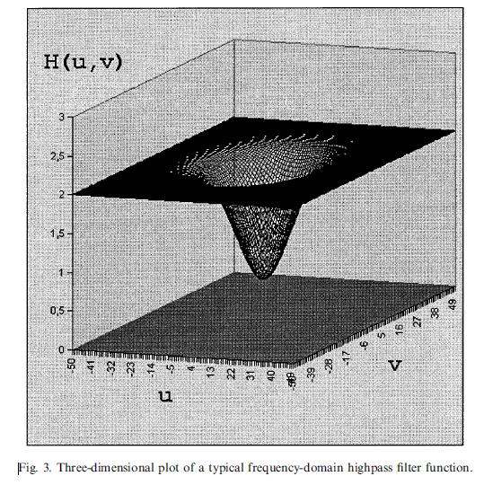
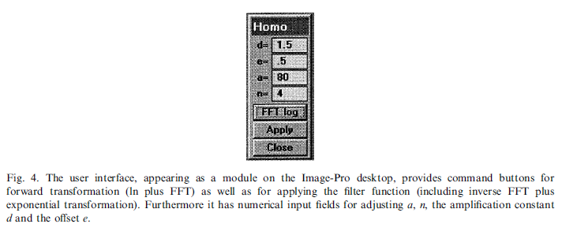
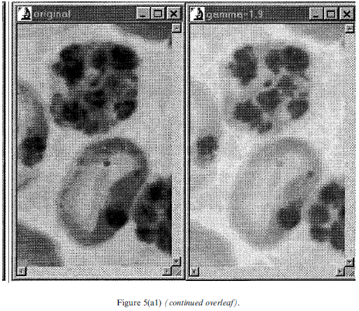
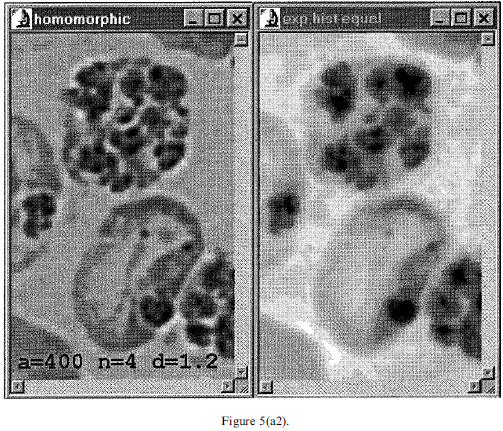
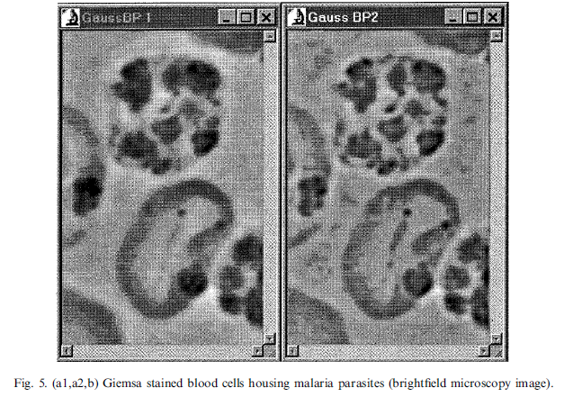
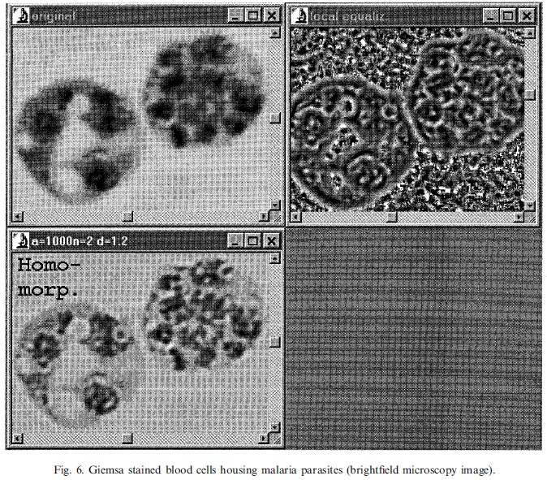
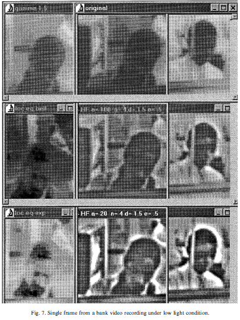
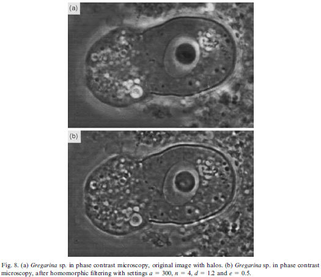

​	部分markdown不能正常显示，见[本人博客](http://blog.csdn.net/renjiewen1995/article/details/79321920#%E4%B8%AD%E6%96%87%E7%BF%BB%E8%AF%91) 。

# MyHomomorphicFilter

[TOC]

​	使用OpenCV实现同态滤波器：代码依据论文：Butterworth equations for homomorphic Filtering of images”， Computers in Biology and Medicine 28 (1998)实现。

其中改进巴特沃斯型高通滤波器的通用方程：
$$
H(u,v) =1-\frac{1}{1+(\frac{u^2+v^2}{a})^n}\tag{7}
$$
同态滤波的滤波函数为：
$$
H(u,v)'=d\cdot H(u,v)+e \tag{11}
$$
其中n越大，斜率越大；a越大，转换点越大。d通常取1.5，e取0.5。根据实际图像可调整参数。

​	**特别要注意输出图像的直流分量不应该改变，即对应巴特沃斯滤波器在二维频域中的零点位置应为1；**

# 中文翻译：

## 题目：图像同态滤波的Butterworth方程(Butterworth equations for homomorphic Filtering of images)

​	**摘要：** 在数字图像处理中，同态滤波方法来自图像的照明反射模型。同态滤波可以同时执行**动态范围压缩和对比度增强**。同态滤波方法成功的关键是选择合适的频域滤波函数，以便不同地修改图像的照明和反射分量。 作者发现巴特沃斯型高通方程远优于其他频域滤波函数，包括高斯方程，使巴特沃斯高通适用于同态滤波方法。

​	该程序是用微软(MS)Visual C ++(滤波器)以及MS Visual Basic(用户界面)编写的，作为图像处理软件包Image-Pro Plus 1998下的模块运行。Elsevier Science Ltd.保留所有权利。

## 1. 介绍

​	同态滤波器是一种基于照明反射图像模型的方法。据说能够同时进行亮度范围压缩和对比度增强[1,2]。作者找不到任何可用的商业软件包提供这滤波方法。 此外，在互联网、计算和图像处理相关的新闻组上搜索这个主题也不能得到有效信息。 因此作者决定基于参考文献 [1,2]给出的理论对同态滤波器的实现进行编程。包括设计适当的频域滤波器函数，并且与其他先进的图像增强方法相比，评估同态滤波器的性质，例如频域高斯带通滤波[3]和局部直方图均衡.

​	为了理解如何将一张图片使用光照反射模型解释，下文将简要叙述该模型。**非零和有限**二维图像函数$f(x，y)$ 用于表示图像：两个空间变量x和y表示图像中的任意点、函数f(x，y)的值表示给定图像像素的幅度(亮度)。通常，一个物体的图像由两部分组成：照亮物体的光、物体反射的光。照明$i(x，y)$和反射$r(x，y)$分量通过乘法关系[2]形成对应物体图像$f(x，y)$ ：
$$
f(x,y)=i(x,y)\cdot r(x,y) \tag{1}
$$
其中$i(x,y)$ 决定于光源的性质，$r(x,y)$ 决定于给定物体的光学特性（理论推导见[1]\[2]）

​	对图像光照分量和反射分量区别对待提供了图像增强新的视角。频域图像滤波是多样且强大的，然而，不幸的是，对光照分量和反射分量进行不同的处理通常是难以实现的，因为两个分量乘积的傅里叶变换是不可分的。
$$
F\{f(x,y)\}\ne F\{i(x,y)\}\cdot F\{r(x,y)\} \tag{2}
$$
一种可行的方法是，在计算傅里叶变换前计算图像的自然对数：
$$
ln(f(x,y))=ln(i(x,y))+ln(r(x,y)) \tag{3}
$$
这将允许频域中关照分量和反射分量的分离：（F,I,R分别表示ln f, ln i, ln r的傅里叶变换）
$$
F(u,v)=I(u,v)+R(u,v) \tag{4}
$$
折将允许频域滤波器对两个分量做不同处理。此时，频域滤波通过图像的傅里叶变换（F）和滤波器的傅里叶变换(H)的乘积实现：
$$
G(u,v)=F(u,v)\cdot H(u,v) = I(u,v) \cdot H(u,v) + R(u,v)\cdot H(u,v) \tag{5}
$$
因为光照的特征通常是空间中缓慢的变化，因此对应于频域中的低频部分。在二维傅里叶变换中，光照分量接近于中心位置。相对而言，反射分量表示了物体间的空间变化，因此通常对应于频域中的高频部分，具体取决于物体中细节的数量。因此，在二维傅里叶变换中反射分量处于较为外部的部分。尽管在傅里叶变换域中，光照分量和反射分量并不是严格分离的，同态滤波依然是有用的，并提供了很好的图像增强结果，如后文所示。在频域滤波后，对频域中的滤波结果进行傅里叶反变换到空间域中。接下来还需要对上一步结果进行以常数e为底的指数运算，来消除之前进行的对数运算的影响。

​	同态滤波方法可以总结在图1中，该图说明了这种图像处理技术涉及步骤的流程图。

​	尽管重点在这里被涵盖，但是对同态滤波方法的详细推导超出了本文的范围，可以在参考文献中找到[1,2]。

## 2.频域滤波函数

​	如前所述，照明分量位于二维傅立叶变换的中心附近，而反射分量更多地位于二维傅里叶频谱的外部区域，尽管它们不是严格分开的。为了同时实现动态范围压缩和对比度增强，频域滤波器的传递函数应该减小图像照明分量的总体频谱能量，同时放大图像反射分量的光谱能量。为了以上述方式加权复数傅立叶系数，Gonzalez和Woods [1]指出，适用于同态滤波的二维滤波函数应该为傅里叶变换的中心区域产生0.5的值（使照明分量的频谱能量减半）为频域的外部区域的值为2.0（反射分量的频谱能量加倍），并且在这两个区域之间平滑过渡。**然而，为了根据每个对象的空间需求调整过滤器，作者发现有必要提供一种调整过渡的方法，即过滤器响应的“截止”。**此外，过渡斜率应该具有一定的坡度，以便对照射和反射分量的影响之间进行良好的区分，但不能太陡峭（甚至是矩形），因为这会将“振铃”伪影[1,5]引入滤波后的图像，振铃现象形成的原因是在频域中引入陡峭的能量阶梯步骤。在测试的几种可能的传递函数中，使用下面给出的通用方程来计算高斯高通响应（注意，所有滤波器在这里以它们的频域表示给出）：
$$
H(u,v) =1-e^{-a(u^2+v^2)}\tag{6}
$$
以及改进巴特沃斯型高通滤波器的通用方程：
$$
H(u,v) =1-\frac{1}{1+(\frac{u^2+v^2}{a})^n}\tag{7}
$$

以上两个高通滤波器被用于更进一步的估计几个测试对象。最后，作者发现改进巴特沃斯方程最适合用于同态滤波方法，因为该方程允许在整个范围内比f.ex高斯方程更陡的斜率，并且更容易调整滤波器响应的过渡（截止）。巴特沃斯方程能够在很大程度上彼此独立的设置**转换点和转换斜率**，从而允许将滤波器精确调整为图像的内容和空间维度。方程（7）中给出的改进巴特沃斯方程中。 该项：
$$
\frac{u^2+v^2}{a}\tag{8}
$$
决定了**转换点**，而巴特沃斯功率系数n决定了**转换斜率**的陡度（**指数n必须是2的正幂**）。其中n越大，斜率越大；a越大，转换点越大。

 图2中的滤波器模拟显示了对于256×256像素图像频谱的a和n的不同取值，导致具有不同转换点和转换斜率的滤波器曲线。在左侧，传统巴特沃斯方程曲线通过下式绘制：
$$
q=\sqrt{u^2+v^2}\tag{9}
$$
而在右侧，改进巴特沃斯方程的曲线通过下式绘制：
$$
q=u^2+v^2\tag{10}
$$
Gonzalez和Woods [1]提出滤波器响应的最大函数值为2、作为偏移量的最小值为0.5设计方案，可以很容易地通过给原本滤波器响应（产生0~1之间的值）的公式(6)(7)乘以一个放大系数d（1.5），并加上一个偏移量e(0.5)来实现。 
$$
H(u,v)'=d\cdot H(u,v)+e \tag{11}
$$

​	然而，当将同态滤波器应用于不同类型的图像时，作者发现，如果将放大系数都设为1.5，可能导致“对比度过度增强”的处理结果，这些现象将在结果部分与样本图像一起讨论。

​	尽管上面的二维图中展示了滤波函数的频域表示，但要认识到，之前所讨论的二维滤波函数的频谱实际上应该是图2中$H(u,v)$围绕坐标轴旋转形成的结果。为了更好的认识滤波函数，如图3展示了其三维外观。

## 3.计算机程序

​	本章不关注VB实现的用户界面，仅关注C语言实现的频域滤波器的一些细节，如图4（通过windows动态链接库实现）

​	改进的巴特沃斯滤波器按下式在C语言中实现：
$$
(1-(1/(1+pow(square\_q/(double)coeff\_a),(double)coeff\_n))))*var\_d + var\_e
$$

其中square_q表示给定点距傅里叶变换中心的径向距离的平方，由$u^2 + v^2$给出。变量coeff_a，和变量coeff_n等同于第二章中所讨论的巴特沃斯滤波器方程中的a和n。var_d表示放大系数d，var_e表示偏移量e。

​	浮点数格式的图像首先载入内存，然后进行以e为底的对数运算（在对数运算前，给每个像素值加一个很小的浮点数，以保证其大于0）。然后进行FFT，得到复数表示的频域图像。应用频域滤波器通常意味着通过将图像幅度谱的当前值与滤波器函数相应局部值相乘，来对幅度谱进行加权。这可以简化为：当将复数傅立叶系数的实部和虚部与滤波函数相乘时，只有幅度被修改而相位未被改变，**因此不需要从傅里叶系数计算幅度谱，从而使这个频域滤波器方法相当快** （*这里并没有理解*）。在傅立叶逆变换之后，所得到的阵列再指数变换以生成滤波图像。

## 4.结果

​	虽然同态滤波方法是基于图像照明和反射模型的，但它也适用于透射照明产生的图像（例如明视场显微镜）。 这并不令人惊讶，因为这里的反射分量在这里被吸收分量代替，吸收分量也承载物体内的空间变化。 照明分量当然也存在于此处。 第一个图像例子（图5）展示了Giemsa染色的血细胞容纳疟疾寄生虫。 原始图像是用明视场显微镜拍摄的，它是一个高对比度高动态范围的图像。多种图像处理方法被用来增强对黑暗区域结构的感知，代表寄生虫，同时试图保持图像明亮和黑暗区域结构的对比度平衡（图5a和b）。

​	从这里可以看出，调整伽玛值（图5a1，右图）会导致对黑暗区域的更清晰的感知，但会完全消除中等灰度和明亮区域。指数直方图均衡（图5a2，右图）在这个例子中效果不佳，导致图像不平衡和过度对比度增强。

​	然而，同态滤波使用图像中给出的参数设置对亮区和暗区（图5a2，左边）进行较好的均衡。

​	从下面的比较可以看出（图5b），应用频域高斯带通滤波器[3]表现相当好，但是在黑暗结构的感知得到显着改善之前，从图像中去除了太多的低频，损害处理图像的对象相似性。

​	在图5（b）中，标题为GaussBP 1的子图像中，零频率分量（ZFC）周围仅有非常少量的低频被去除。这显然不足以导致在黑暗图像区域（寄生虫）中的结构的良好感知性。在右边的图5（b）中，高斯BP 2的子图像中，大量的低频被去除，使得黑暗区域中的更多结构可辨别，但是导致这些区域相当明显的对比度下降。

​	同态滤波器在这里效果最好，压缩了图像的高动态范围，并平衡了暗区和亮区，同时在这两个区域执行对比度增强。尽管黑暗区域的细节感知得到了极大的增强，但对于明亮区域的对比度也是平衡的，并且与所讨论的其他增强方法相比，处理图像的物体相似性基本保持不变。

​	**通过明场透视法获得的显微图像有时也难以通过局部直方图均衡来增强**，（why）这种技术中图像直方图仅在正在处理的区域的当地邻域范围内进行优化。

​	下一个例子，也是疟疾图片（图6），显示了局部直方图均衡与同态滤波的比较。尽管黑暗区域的结构有所改善，但这些结构受到的剧烈变化、人造的边界的干扰，这些干扰由邻域的处理引起。很明显，保持目标相似性不是局部直方图均衡的领域。

​	下一个例子处理从银行视频中捕获的图像（图7，而不是生物或医学应用，但实际上是由反射光产生的图像）。此影像是Media Cybernetics出于演示目的而发布的，并附带了Image-Pro plus软件包。这是一个低对比度、高动态范围图像。这里再次将同态滤波与伽玛调整和局部直方图均衡进行比较。

​	请注意，使用同态滤波器可以增强一次（HF，a = 100，n = 4，d = 1.5）或甚至两次（第一个HF，a = 100，n = 4，d = 1.5） ，a = 20，n = 4，d = 1.5）。在给定的应用中需要进行大量的处理，以提高对由于极低的局部对比度而难以察觉的面部的识别。 再一次，同态滤波已被证明远优于其他增强方法。

​	下一个例子（图8）显示了如何使用同态过滤器来减少相差显微术中不可避免的光晕效应。由于这些相对较厚的物体引入了大的相位延迟（图8a，原始图像），请注意物体周围的明亮光环（Gregarina sp.）以及物体内的细胞质内含物周围。

​	请注意，尽管光晕大大减少，但仍保留了滤波图像的整体对比度（图8b）。另外，非常黑暗的区域（核仁）以及非常明亮的区域（物体内的颗粒）的特征变得更加明显。

## 5. 讨论和结论

​	同态滤波方法在文献中只提到过几次，大部分是以理论的方式[1,2]。 如本文所述，它可以在具有开放式编程接口的专业图像处理软件包框架内实现。巴特沃斯型高通滤波函数被认为最适合这种方法。同态滤波器已经证明了其同时实现动态范围压缩和对比度增强的理论设想，并且是用于的有价值的图像处理工具。同态滤波器经常被发现在其他增强方法中产生最佳的目标相似性。尽管从理论上根据基于照明和反射的图像模型推导出来，但它也可以用于透视光照，例如：光场和相差显微镜。作者目前正在研究使用同态滤波和其他显微镜方法如差分干涉对比以及放射学和断层扫描图像。 

## 6.总结

​	同态滤波是一种知名度不高却很有价值的图像处理工具，能够同时实现动态范围的压缩和对比度的增强，本文详细描述了该滤波器及其理论基础。本文推导出一种合适且可调整的滤波函数，用于同态滤波方法的频域处理。示例图像展示了该滤波器有价值的图像增强性能。

## 7.参考文献

[1] R.C. Gonzales, R.E. Woods, Digital Image Processing, Addison-Wesley, Reading, Massachusetts, 1992.

[2] T.G. Stockham Jr.., Image processing in the context of a visual model, Proc. IEEE 60 (7) (1972) 828±842.

[3] H.G. Adelmann, A frequency-domain Gaussian ®lter module for quantitative and reproducible high-pass, low-pass and band-pass ®ltering of images, Am. Lab. 29 (6) (1979) 27±33.

[4] M. Sonka, V. Hlavac, R. Boyle, Image Processing, Analysis and Machine Vision, Chapman and Hall, London,1995.

[5] K.R. Castleman, Digital Image Processing, Prentice-Hall, Englewood Cli€s, New Jersey, 1996.

